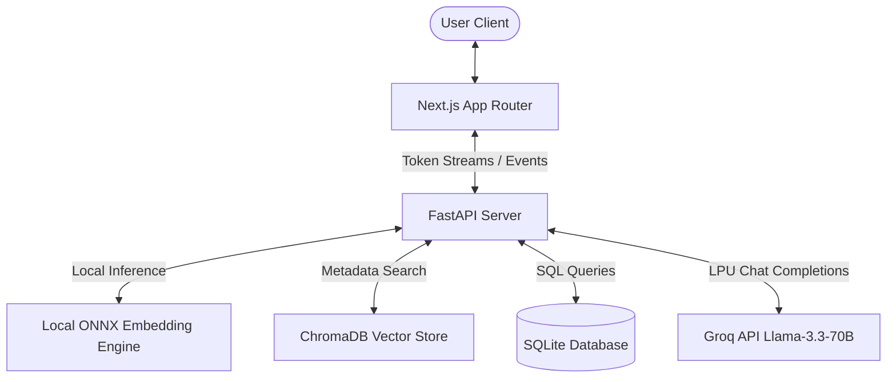

# EMB AI Engineer Assessment: Dual-Mode Agentic RAG Chatbot

This repository contains the submission for the **EMG Global Assessment (AI Engineer)**. The application is a production-ready, dual-mode conversational agent that intelligently orchestrates between **Structured Database Querying (Text-to-SQL)** and **Unstructured Policy Search (Agentic RAG)** to answer queries about a company's internal operations and order tracking.

---

## 🚀 Live Links
*   **Live Chatbot Interface (Next.js):** [https://emb-rag-chatbot-theta.vercel.app](https://emb-rag-chatbot-theta.vercel.app)
*   **Live API Server (FastAPI):** `https://emb-rag-chatbot.onrender.com`

---

## 🏛️ Architecture Overview

The system is built as a split-client architecture designed for speed, lightweight containerization, and easy horizontal scaling:



### 1. Backend (FastAPI)
*   **Streaming Responses:** Uses Server-Sent Events (SSE) via `StreamingResponse` to stream token-level completions and real-time step events (e.g., routing decisions, generated SQL queries, SQL results, citations) directly to the user interface.
*   **Auto-Seeding Lifespan:** On application startup, the lifecycle hooks automatically:
    1. Read `orders.csv` and initialize/seed the SQLite database.
    2. Extract PDF text, chunk, and embed/index internal policies into the vector store.
    This guarantees zero-configuration deployment on empty or ephemeral container environments.

### 2. Frontend (Next.js)
*   **Real-time Event Parser:** Decodes the backend's SSE stream chunk-by-chunk to render interactive UI elements (like executing SQL panels, live data tables, and PDF source tags) as the AI is thinking.

---

## 🛠️ Key Technical Choices & Rationale

### 1. LLM Engine: Groq (`llama-3.3-70b-versatile`)
*   **Decision:** Switched the LLM provider to Groq running Meta's `llama-3.3-70b-versatile`.
*   **Rationale:** Groq's LPU (Language Processing Unit) inference delivers ultra-low latency token streams (often completing tasks in <1s), which is crucial for multi-step agent workflows. It also provides a robust, free developer tier that handles structured JSON modes and complex reasoning without token charges.

### 2. Embedding Model: Local `ONNXMiniLM_L6_V2`
*   **Decision:** Configured ChromaDB to use the local `ONNXMiniLM_L6_V2` embedding function run natively inside the Python runtime via `onnxruntime`.
*   **Rationale:** Running embeddings locally inside the container runtime avoids external API calls, billing gates, and API rate-limiting issues entirely. It is lightweight, fast, and provides 384-dimensional dense vectors suited for domain FAQ matching.

### 3. Vector Database: ChromaDB
*   **Decision:** Used Chroma's persistent storage library configured for local disk storage.
*   **Rationale:** Chroma is a lightweight, serverless vector store that runs out-of-the-box inside a Docker container without needing dedicated hosting or complex database configuration.

### 4. Database: SQLite
*   **Decision:** Used the standard Python `sqlite3` library pointing to a local file database.
*   **Rationale:** SQLite is clean, fast, and perfect for holding the ~200 rows of the orders table. It allows robust SQL querying and guarantees that database execution adds negligible latency to the agent's cycle.

---

## 🧠 How the Intelligent Router Works

The chatbot uses a hybrid routing mechanism to categorize questions and fetch the necessary context:

```
                  [User Question]
                         │
                         ▼
             ┌──────────────────────┐
             │ Keyword Fast-Path    │──► (Instant fallback if
             │ Heuristic (Offline)  │     LLM API fails)
             └──────────────────────┘
                         │
                         ▼
             ┌──────────────────────┐
             │   Groq LLM Router    │ (Classifies with structured
             │     (JSON Mode)      │  JSON output)
             └──────────────────────┘
                         │
         ┌───────────────┼───────────────┬───────────────┐
         ▼               ▼               ▼               ▼
      ["sql"]         ["rag"]        ["both"]         ["none"]
   Execute SQL      Query Chroma     SQL + RAG       Fallback
      Query          Vector Store    Retrieval     ("I don't have...")
```

1.  **Fast Heuristic Fallback:** If the LLM API is unavailable, a fast keyword router matches terms (e.g., "policy", "refund" $\rightarrow$ RAG; "revenue", "status" $\rightarrow$ SQL) to classify the route.
2.  **LLM Router (JSON Mode):** Under normal operations, the query is sent to the LLM router, which responds in structured JSON with the target route (`sql`, `rag`, `both`, or `none`) and the reasoning.
3.  **Temporal Consistency:** To guarantee correct SQL date calculations and return policies, the agent's system prompts are injected with a fixed context date: **15 June 2026**. Relative terms like *"last month"* are calculated mathematically relative to this date.

---

## 📁 Directory Structure

```
├── backend/                  # Python FastAPI Backend
│   ├── app/
│   │   ├── data/             # CSV source data & PDF documents
│   │   ├── routes/           # SSE chat API endpoint
│   │   ├── services/         # LLM client, vector store, SQL execution
│   │   └── main.py           # Startup lifecycle & auto-seeding
│   ├── import_orders.py      # SQLite seeding script
│   ├── requirements.txt      # Python dependencies
│   └── Dockerfile
├── frontend/                 # Next.js Frontend React Webapp
│   ├── app/                  # Main layout & pages
│   ├── components/           # Chat interface & UI blocks
│   ├── lib/                  # Streaming API utilities
│   ├── tailwind.config.js    # UI theme styling
│   └── Dockerfile
└── docker-compose.yml        # Orchestration configurations
```

---

## ⚙️ Local Setup Instructions

### Option A: Using Docker Compose (Recommended)
This runs the entire multi-container environment locally:

1.  Clone this repository:
    ```bash
    git clone https://github.com/Anirudh596/emb-rag-chatbot.git
    cd emb-rag-chatbot
    ```
2.  Create a `.env` file inside `backend/.env` (using the template in `backend/.env.example`):
    ```env
    LLM_PROVIDER=groq
    MODEL_NAME=llama-3.3-70b-versatile
    GROQ_API_KEY=your_groq_api_key
    ```
3.  Launch the containers:
    ```bash
    docker-compose up --build
    ```
4.  Open the web interface at `http://localhost:3000`.

---

### Option B: Local Development Run (Manual)

#### 1. Backend Setup
1.  Navigate to `/backend`:
    ```bash
    cd backend
    ```
2.  Create a virtual environment and install packages:
    ```bash
    python3 -m venv venv
    source venv/bin/activate
    pip install -r requirements.txt
    ```
3.  Configure your environment variables in `.env`.
4.  Start the FastAPI development server:
    ```bash
    uvicorn app.main:app --reload --port 8000
    ```

#### 2. Frontend Setup
1.  Navigate to `/frontend`:
    ```bash
    cd ../frontend
    ```
2.  Install dependencies:
    ```bash
    npm install
    ```
3.  Set environment variables:
    Create a `.env.local` containing:
    ```env
    NEXT_PUBLIC_BACKEND_URL=http://localhost:8000
    ```
4.  Run the development server:
    ```bash
    npm run dev
    ```
5.  Open `http://localhost:3000` in your browser.

---

## ⚠️ Known Limitations & Edge Cases

*   **Render Cold Starts:** Because the backend is hosted on Render's free tier, the instance will spin down after 15 minutes of inactivity. The first query after a cold start can take ~50 seconds to initialize, though subsequent queries respond instantly.
*   **Ephemeral Disk Storage:** Render's free container storage is ephemeral. However, our backend handles this seamlessly by auto-seeding the SQLite database and rebuilding the ChromaDB vector index from the project files on every container boot.
*   **Rate Limits:** Since we run multiple LLM calls per message, we wrap our API client with `tenacity` retries using exponential backoff to handle rate limits gracefully.
